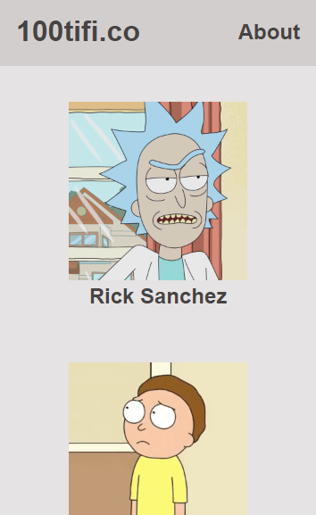

# Single Page Application Course of Platzi
SPA using the API of Rick and Morty with Javascript, Css, Html, nodeJS and Webpack.
 This is a practice of course of platform of platzi (https://platzi.com/cursos/spa-javascript/) and I learn how 
make SPA with Javascript Vanilla and webpack.

## Home of SPA - Desktop

## Home of SPA - Mobile

## Info of Character - Desktop

## Info of Character - Mobile

## Error 404 - Desktop

## Error 404 - Mobile

Link of SPA: https://alexisromanvc2002.github.io/Single-Page-Application-Platzi/
